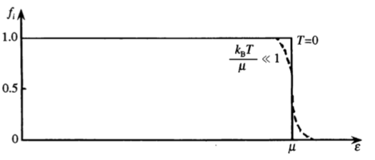
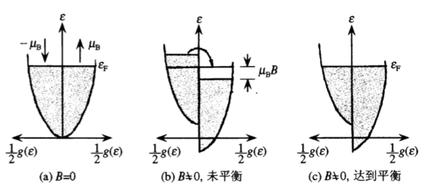

# 固体物理基础
## 第一部分  理想晶体
### 第一章  金属自由电子气体模型
&emsp; &emsp; 第一步近似，将固体中的原子分为离子实(ion core) 和价电子(valence electron)两部分。

* 离子实：由原子核和内层结合能高的芯电子(core electron)组成
* 价电子：原子外层**结合能低**的电子

#### 模型和基态性质
&emsp; &emsp;  自由电子气体模型把金属简单的看作价电子组成的电子气体，有两个基本假定：

* 忽略电子和离子实之间的相互作用，电子自由运动的范围仅存在表面势垒而限制在样品内部（凝胶模型(jellium model)）
* 忽略电子和电子之间的相互作用（独立电子近似）

&emsp; &emsp; 自由电子模型只有一个独立的参量：电子密度$n$. 关系如下
$$
    n=N_A \frac{Z \rho_m}{A}
$$

如果把每个电子平均占据的体积等效为球，得到球半径和电子密度之间的关系
$$
    r_s = \left(\frac{3}{4 \pi n}\right)^{1/3}
$$

##### 单电子本征态和本征能量
&emsp; &emsp; 凝胶背景下可以认为是常数势，并可简单地取为0，在这种情况下自由电子的波函数可以取**平面波解**。

&emsp; &emsp; 由于边界条件的存在，波矢$k$ 的取值有限制，并考虑金属主要是体性质，所以采取周期性边界条件。这个条件在三维情况下类似谐振腔。

&emsp; &emsp; 由此得到离散的波矢解。如果将这样的波矢看作空间矢量，相应的空间称为$k$空间，$k$空间由分立的点构成，每个点占据的体积为
$$
    \Delta k = \left(\frac{2 \pi}{L}\right)^3 = \frac{8 \pi^3}{V}
$$

##### 基态和基态的能量
&emsp; &emsp; 基态即当$T = 0$时的系统能量，这个时候电子在$k$空间的占据满足泡利不相容原理，即每个$k$点有且仅有两个电子。由于$N$ 的数目很大，占据区最后成为一个球，一般称为**费米球**(Fermi sphere)，其半径为**费米波矢**(Fermi wave vector)，记为$k_F$. 在$k$空间中把占据态和未占据态分开的界面叫做**费米面**.

&emsp; &emsp; 利用$k$空间中国态密度的表达式可以得到$k_F$和$n$的联系
$$
    k+F^3 = 3 \pi^2 n
$$
由此得到费米能量(Fermi energy)
$$
    \varepsilon_F = \frac{\hbar^2 k_F^2}{2m}
$$
相应的还有费米动量(Fermi momentum)$p_F = \hbar k_F$，费米速度(Fermi velocity)$v_F= \hbar k_F /m$，和费米温度(Fermi temperature)$T_F = \varepsilon_F / k_B$，其中$k_B$为玻尔兹曼常数。

&emsp; &emsp; 单位体积自由气体的基态能量可以通过费米求内所有单电子能级的能量得到。有一个因子2，这是由于每个态有两个电子。将求和过渡为积分，最终得到每个电子的平均能量为
$$
    \frac{\mathscr{E}}{V} = \frac{3}{5}\varepsilon_F
$$

&emsp; &emsp; 常引入单位体积的态密度，电子态数由此为
$$
    \mathrm{d} N = Vg(\varepsilon) \mathrm{d} \varepsilon
$$

我们已知在$k$ 空间的态密度，利用其以及$k$和$\varepsilon$的关系，可以求得
$$
    g(\varepsilon) = \frac{1}{\pi^2 \hbar^3}(2 m^3 \varepsilon)^{1/2}
$$

&emsp; &emsp; 常常用到在费米面处的态密度，由上式可以得到
$$
    g(\varepsilon_{F}) = \frac{3}{2} \frac{n}{\varepsilon_F}
$$

以及
$$
    g(\varepsilon_F) = \frac{m k_F}{\pi^2 \hbar^2}
$$

&emsp; &emsp; 基态时每个电子的平均能量也可以通过$g(\varepsilon)$计算，得到的结果和之前也是一样的。

#### 自由电子气体的热性质
&emsp; &emsp; 在$T \ne 0$时$N$个电子在本征态上的分布不能简单用泡利不相容原理决定，而要用**费米-狄拉克分布函数**，即
$$
    f_i = \frac{1}{e^{(\varepsilon_i - \mu)/k_B T}+1}
$$

化学势由总粒子数决定
$$
    N = \sum_i f_i
$$

考虑极限情况
$$
    \lim_{T \to 0} f_i = \left\{\begin{aligned}
        &1,\quad 当\varepsilon_i < \mu \\ 
        &0,\quad 当\varepsilon_i>\mu
    \end{aligned}\right.
$$

因而，占据态和非占据态在化学势处有一个清晰的分界，并且
$$
    \lim_{T \to 0} \mu = \varepsilon_F
$$

##### 化学势随温度的变化

&emsp; &emsp; $T \ne 0$ 时自由电子气体单位体积的内能为
$$
    u = \frac{2}{V} \sum_k \varepsilon(\boldsymbol{k})f_{k} = \frac{1}{4 \pi^3} \int \varepsilon(\boldsymbol{k})f_k \mathrm{d} \boldsymbol{k}
$$

化学势由
$$
    n = \frac{2}{V} \sum_k f_k = \frac{1}{4 \pi^3} \int f_k \mathrm{d} \boldsymbol{k}
$$
决定。

&emsp; &emsp; 可以改写为
$$
    \begin{aligned}
        u & = \int_{0}^{\infty} \varepsilon g(\varepsilon) f(\varepsilon) \mathrm{d} \varepsilon \\ 
        n & = \int_{0}^{\infty} g(\varepsilon) f(\varepsilon) \mathrm{d} \varepsilon
    \end{aligned}
$$

对于类似的积分形式
$$
    I = \int_{0}^{\infty} H(\varepsilon) f(\varepsilon) \mathrm{d} \varepsilon
$$

可以证明
$$
    I = \left.Q(\varepsilon)f(\varepsilon)\right|_{0}^{\infty} + \int_{0}^{\infty} Q(\varepsilon) \left(- \frac{\partial f}{\partial \varepsilon}\right) \mathrm{d} \varepsilon
$$
其中
$$
    Q(\varepsilon) \equiv \int_{0}^{\varepsilon} H(\varepsilon) \mathrm{d} \varepsilon
$$

&emsp; &emsp; 上式右边第一项为零，第二项由于括号内的表达式类似于$\delta$函数的对称窄峰，所以对$Q(\varepsilon)$在$\mu$处作泰勒展开，保留到二阶近似，由于一阶近似积分为0，故最后结果为
$$
    I = Q(\mu) + \frac{\pi^2}{6}Q^{\prime \prime}(\mu)(k_B T)^2
$$

&emsp; &emsp; 由于$\mu(T)$实际上与$\varepsilon_F$非常接近，所以再用一个近似
$$
    Q(\mu) = Q(\varepsilon_F)+ (\mu - \varepsilon_F)Q^{\prime}(\varepsilon_F)
$$

这个时候再利用基态电子密度的关系式，就可以得到
$$
    n=\int_{0}^{\epsilon_{F}} g(\varepsilon) \mathrm{d} \varepsilon+\left(\mu-\varepsilon_{\mathrm{F}}\right) g\left(\varepsilon_{\mathrm{F}}\right)+\frac{\pi^{2}}{6} g^{\prime}\left(\varepsilon_{\mathrm{F}}\right)\left(k_{\mathrm{B}} T\right)^{2}
$$

等式右边第一项为基态电子密度，由于电子密度与温度无关，与等式左边相消，因而
$$
    \mu = \varepsilon_F - \frac{\pi^2}{6} \frac{g^{\prime}(\varepsilon_F)}{g(\varepsilon_F)} (k_B T)^2
$$

&emsp; &emsp; 对于自由电子气体，由于$g(\varepsilon) \propto \varepsilon^{1/2}$，所以
$$
    \mu = \varepsilon_F \left[1 - \frac{\pi^2}{12}\left(\frac{k_B T}{\varepsilon_F}\right)^2\right]
$$

室温下，化学势和$\varepsilon_F$很接近，所以也常把$\mu$称为费米能量。

##### 电子比热
&emsp; &emsp; 现在来处理内能相关的方程。类似地，可以得到
$$
    u=\int_{0}^{\varepsilon_{F}} \varepsilon g(\varepsilon) \mathrm{d} \varepsilon+\varepsilon_{\mathrm{F}} g\left(\varepsilon_{\mathrm{F}}\right)\left(\mu-\varepsilon_{\mathrm{F}}\right)+\frac{\pi^{2}}{6} \frac{\mathrm{d}}{\mathrm{d} \varepsilon}(\varepsilon g(\varepsilon))_{\varepsilon_{\mathrm{F}}}\left(k_{\mathrm{B}} T\right)^{2}
$$

代入化学势的表达式，并注意到等式右边第一项为基态单位体积的内能$\mu_0$，所以得到
$$
    u - u_0 \frac{\pi^2}{6}g(\varepsilon_F)(k_B T)^2
$$

&emsp; &emsp; 从另外一个视角对这个结果进行估计。由于泡利不相容原理的限制，在$T \ne 0$的时候，电子的热激发仅仅发生在费米面附近。由于能够热激发的电子数约为$g(\varepsilon_F)k_B T$，每个热激发的电子平均获得的能量约为$k_B T$，因此，$\mu - \mu_0$约为$g(\varepsilon_F) (k_B T)^2$.

&emsp; &emsp; 对上式进行改写，得到
$$
    u = u_0 \left[1 + \frac{5}{12}\pi^2 \left(\frac{T}{T_F}\right)^2\right]
$$
这也是更常用的形式。

&emsp; &emsp; 得到内能表达式后自然而然可以得到比热
$$
    c_V = \left(\frac{\partial u}{\partial T}\right)_n = \frac{\pi^2}{3} k_B^2 g(\varepsilon_F)T
$$

也常写作
$$
    c_V = \gamma T
$$

其中，$\gamma$称为**电子比热系数**，正比例于费米面上的态密度。

#### 泡利顺磁性
&emsp; &emsp; 电子具有1个玻尔磁子的磁矩
$$
    \mu_B = \frac{e \hbar}{2 m}
$$

&emsp; &emsp; 在外场$\boldsymbol{B}$的作用下，电子自旋磁矩有与外场平行和反平行两个取向，可将态密度曲线分成两半。外场会使这两半沿能量轴向相反方向平移$\mu_B B$，这种平移实际上是很小的。对于磁矩方向与外场方向相反的电子，能量较高的电子将磁矩反转，填到磁矩与外场方向相同的空态上。体系平衡时，两种磁矩取向的电子有相同的化学势。

&emsp; &emsp; 发生磁矩反转的电子数为
$$
    N = \frac{1}{2} \mu_B g(\varepsilon_F)
$$

每反转一个电子，沿磁场方向磁矩改变$2 \mu_B$，产生的总磁矩为
$$
    M = \mu_B^2 g(\varepsilon_F)B
$$

相应的磁化率为
$$
    \chi=\frac{\mu_{0} M}{B}=\mu_{0} \mu_{\mathrm{B}}^{2} g\left(\varepsilon_{\mathrm{F}}\right)
$$

通常称为**泡利顺磁磁化率**，其中$\mu_0$为真空磁导率。更仔细的计算表明需要对$\mu_0$乘以温度修正因子，但一般可以忽略不计。

&emsp; &emsp; 和经典理论的差别同样来源于泡利不相容原理的限制，导致有贡献的只是费米面附近的电子。但与电子比热相比，这一关系在非自由电子气体下应用不大，这是因为离子实具有抗磁性，价电子作为运动着的带电粒子也会产生抗磁性，用常规的测量手段，**难以将泡利顺磁性的贡献从总的磁化率中准确干净地分离出来**。

#### 电场中的自由电子
&emsp; &emsp; 下面将要讨论在外场（电磁场，温度梯度）作用下，自由电子的输运性质和光学性质。

##### 准经典模型
&emsp; &emsp; 相比原来的自由电子气体模型，加入了新的两个假定：

* 电子会受到散射，或经受碰撞，从而突然改变电子的速度，使其达到与环境的热平衡；其余时间电子做直线运动
*  对于电子受到的散射或碰撞，简单地用**弛豫时间**(relaxation time)$\tau$描述。其大体相当于电子相继两次散射间的平均之间，是模型中除了电子密度$n$外，另一个独立的参量

&emsp; &emsp; 由于电子为量子客体，外场作用下自由电子的行为应从相应的含时间薛定谔方程中得到。对于外加电场$\boldsymbol{E}$的情况，方程为
$$
    \left(-\frac{\hbar^{2}}{2 m} \nabla^{2}-e \phi\right) \psi(\boldsymbol{r}, t)=\mathrm{i} \hbar \dot{\psi}(\boldsymbol{r}, t)
$$

当且仅当在粒子动量较大，外场变换缓慢时，过渡到经典情况，这相当于上述方程取波包解，波包中心坐标和动量期待值的变化满足经典的运动方程。

&emsp; &emsp; 费米球的存在使金属中的电子有较高的动量，典型值为$\hbar k_F$. 确定的动量要求不确定度远小于$\hbar k_F$，由此得到坐标的不确定程度
$$
    \Delta x \approx \frac{\hbar}{\Delta p} \gg \frac{1}{k_F} \approx r_s
$$

在金属中，$r_s$和离子实间距数量级相同，坐标的不确定度约为多个原子（离子实）间距。 除去应远小于样品尺寸外，只要在这个尺度内，外场的变化足够缓慢；只要和电子相继两次碰撞所走的平均距离——**平均自由程**(mean free path)相比，这个尺度足够小，电子的行为就可用经典方式描述。

&emsp; &emsp; 对外场作用下的电子，采用经典的处理方式，但取$v_F$为其平均速度，这种做法，称为**准经典模型**。

##### 电子的动力学方程
&emsp; &emsp; 在$\mathrm{d} t$时间内，没有受到碰撞的电子对平均动量的贡献为
$$
    \boldsymbol{p}(t + \mathrm{d} t) = \left(1-\frac{\mathrm{d} t}{\tau}\right)[\boldsymbol{(t) + \boldsymbol{F}(t) \mathrm{d} t}]
$$

对于受到碰撞的电子，对总动量的贡献仅在于碰撞前在外力作用下所取得的动量变化。由于力的作用不长于$\frac{\mathrm{d} t}{\tau} \boldsymbol{F}(t) \mathrm{d} t$，是二级小量，可以略去，由此在一级近似下得到
$$
    \frac{\mathrm{d} p(t)}{\mathrm{d} t}=\boldsymbol{F}(t)-\frac{\boldsymbol{p}(t)}{\tau}
$$

这称为自由电子在外场作用下的动力学方程。由于$\boldsymbol{p}(t) = m \boldsymbol{v}(t)$，上式可写成
$$
    m \frac{\mathrm{d} \boldsymbol{v}(t)}{\mathrm{d} t} = \boldsymbol{F}(t) - m \frac{\boldsymbol{v}(t)}{\tau}
$$

碰撞的作用，相当于在通常的运动方程中引入一依赖于速度的阻尼项。

##### 金属的电导率
&emsp; &emsp; 对于恒定电场的稳态情形，电场作用在电子上的力$\boldsymbol{F} = - e \boldsymbol{E}$，和阻尼力相同，电子以恒定速度运动。通常将这一速度称为电子的**漂移速度**(drift velocity)$v_d$，可以得到
$$
    v_d = - \frac{e \tau \boldsymbol{E}}{m}
$$

相应的电流密度
$$
    \boldsymbol{J} = - n e v_d = \frac{n e^2 \tau}{m} \boldsymbol{E}
$$

金属遵从欧姆定律，由此得到电导率为
$$
    \sigma = \frac{n e^2 \tau}{m}
$$

&emsp; &emsp; 通过对电导率的测量，可以算出弛豫时间，从而得到平均自由城的大小
$$
    l = v_F \tau 
$$

